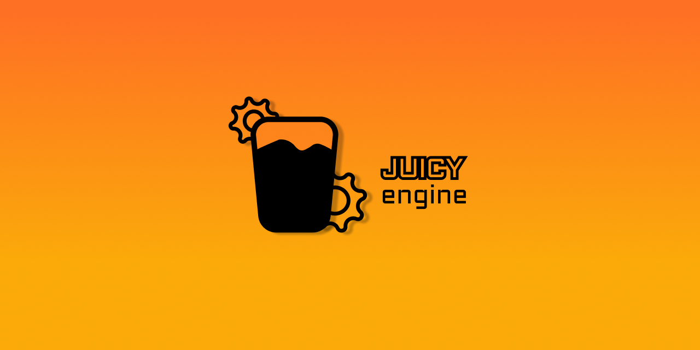

# Juicy Engine




# Goals
    - C++ is the main programming language
    - Vulkan as primary graphics API
---

# REQUIRED
    - VulkanSDK
    - CMake >=  3.31
# Project setup
- Cloning
    ```bash
    git clone https://github.com/juice-artur/JuicyEngine.git --recursive
    ```
- Init submodule 
    ```bash
    git submodule init 
    git submodule update
    ```