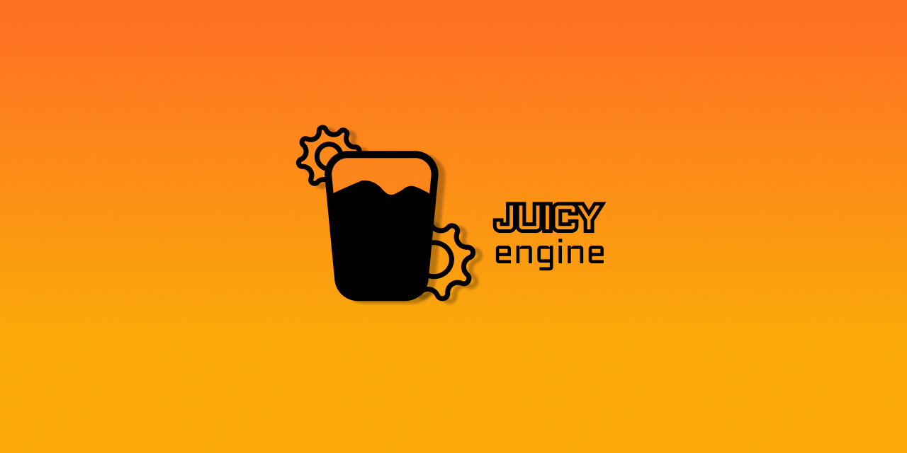

# Juicy Engine




# Goals
- C++ is the main programming language
- Vulkan as primary graphics API
---

## Before Started
 - Install Conan
 - Install Vulkan SDK

# Project setup
- Cloning
    ```bash
    git clone https://github.com/juice-artur/JuicyEngine.git 
    ```
- Run the ```prepare_conan.bat```