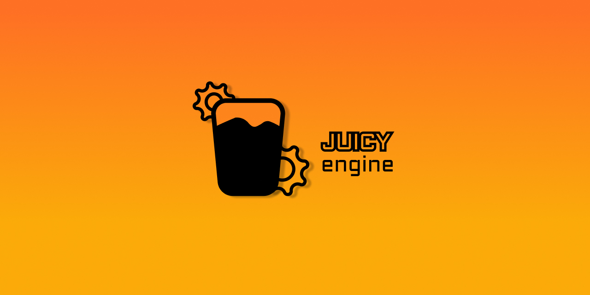

# Juicy Engine




# Goals
- C++ is the main programming language
- Vulkan as primary graphics API
---
# Project setup

## Cloning
```bash
git clone https://github.com/juice-artur/JuicyEngine.git --recursive
```

## Build
1. Create a build directory in the project root: ```mkdir build && cd build```
2. Generate project files with CMake: ```cmake ..```

---
# iOS support

The engine renders with Vulkan on iOS through **MoltenVK** (Vulkan translated onto Metal).
The Vulkan instance, surface and swapchain are created through SDL3, so no platform specific
graphics code is required. Input works through SDL's touch-to-mouse event synthesis.

## Requirements
- macOS with Xcode (iOS SDK + simulator SDK)
- **MoltenVK + Vulkan headers** — one of:
  - **iOS / tvOS builds**: install the LunarG Vulkan SDK for macOS
    (<https://vulkan.lunarg.com/sdk/home>) and set `VULKAN_SDK`; it ships the MoltenVK
    slices for iOS device and simulator. CMake looks for the SDK in these places:
    `$VULKAN_SDK/{Latest/MoltenVK/static,Package/Latest/MoltenVK/static,MacOS/lib,macOS/lib,lib}/MoltenVK.xcframework`.
    If your SDK has another layout, pass `-DJE_MOLTENVK_XCFRAMEWORK=/path/to/MoltenVK.xcframework`.
  - **Native macOS-only builds**: `brew install molten-vk` is enough; the Homebrew
    library is auto-detected, no `VULKAN_SDK` needed.
  - Vulkan headers alone (if the SDK is not installed): `brew install vulkan-headers`.

## Building for an iOS device
```bash
./Scripts/BuildIOS.sh
```
Produces `build-ios/Release-iphoneos/Sandbox.app`. Sign the bundle with your team before
installing on a device, or run it directly in Xcode.

## Building for the iOS simulator
```bash
./Scripts/BuildIOSSimulator.sh
```
Produces `build-ios-simulator/Release-iphonesimulator/Sandbox.app`.

## Building in Xcode
```bash
cmake -S . -B build-ios -G Xcode \
  -DCMAKE_SYSTEM_NAME=iOS \
  -DCMAKE_OSX_SYSROOT=iphoneos \
  -DCMAKE_OSX_DEPLOYMENT_TARGET=14.0 \
  -DCMAKE_OSX_ARCHITECTURES=arm64
```
Then open `build-ios/Sandbox.xcodeproj` and run the `Sandbox` scheme on your device or simulator.

## CI
The GitHub workflow `.github/workflows/ios.yml` builds (and verifies) the app for both a
device and the simulator on every push to `master` and on pull requests.

Downloadable bundles are attached to every iOS workflow run as GitHub Actions artifacts:

1. Open the **Actions** tab -> pick the latest **iOS** run.
2. In the **Artifacts** section download `Sandbox-ios-device` (the `.app` bundle) or
   `Sandbox-ios-device-ipa` (the installable `.ipa`) for iPhones, and
   `Sandbox-ios-simulator` / `Sandbox-ios-simulator-ipa` for the simulator.

### Installing the .ipa on your iPhone with AltStore / Sideloadly
No paid Apple Developer account is needed - both tools re-sign the app with your own
(possibly free) Apple ID on install. The device `.ipa` is ad-hoc signed before it is
packaged, which AltStore/Sideloadly then replace with your Apple ID signature.

**Sideloadly**
1. Download `Sandbox-ios-device-ipa` from the iOS run artifacts.
2. Start Sideloadly, connect your iPhone via USB.
3. Drag the `.ipa` into the window, enter your Apple ID, hit **Start**.

**AltStore**
1. Install AltStore on your iPhone (via AltServer from https://altstore.io).
2. Download `Sandbox-ios-device-ipa` and open it in the **Files** app.
3. Tap **Share** -> **AltStore** to install and let AltStore manage the 7-day refresh.

**Notes for free Apple IDs**
- Apps signed with a free Apple ID expire after **7 days**; AltStore refreshes them
  automatically while the iPhone shares a network with AltServer. Sideloadly needs to
  be re-run when the signature expires.
- Up to 3 apps can be active at the same time on one free Apple ID.
- Enable **Developer Mode** on iOS 16+ (Settings -> Privacy & Security -> Developer Mode).
- If you get *"already signed to your Apple ID"*, change `CFBundleIdentifier` in
  `Platform/iOS/Info.plist` to a unique value.

